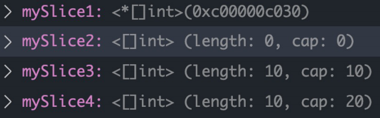

# 常用数据结构
## 变量与常量
- 常量
    - const identifier type
- 变量
    - var identifier type
### 变量定义
- 变量
    - var 语句用于声明一个变量列表，跟函数的参数列表一样，类型在最后。
    - var c, python, java bool
- 变量的初始化
    - 变量声明可以包含初始值，每个变量对应一个。
    - 如果初始化值已存在，则可以省略类型；变量会从初始值中获得类型。
    - var i, j int = 1, 2
- 短变量声明
    - 在函数中，简洁赋值语句 := 可在类型明确的地方代替 var 声明。
    - 函数外的每个语句都必须以关键字开始（var, func 等等），因此 := 结构不能在函数外使用。
    - c, python, java := true, false, "no!"
### 类型转换与推导
- 类型转换
    - 表达式 T(v) 将值 v 转换为类型 T。 
        - 一些关于数值的转换：
            - var i int = 42 
            - var f float64 = float64(i) 
            - var u uint = uint(f)
        - 或者，更加简单的形式：
            - i := 42 
            - f := float64(i) 
            - u := uint(f)
- 类型推导
    - 在声明一个变量而不指定其类型时（即使用不带类型的 := 语法或 var = 表达式语法），变量的类型由右值推导得出。
        - var i int 
        - j := i // j 也是一个 int

## 数组
> code: k8s-mengfanjie/01golang/01examples/01module/06array-slice

- 相同类型且长度固定连续内存片段
- 以编号访问每个元素
- 定义方法
    - var identifier [len]type
- 示例
- myArray := [3]int{1,2,3}
## 切片(slice)
> code: k8s-mengfanjie/01golang/01examples/01module/06array-slice

- 切片是对数组一个连续片段的引用
- 数组定义中不指定长度即为切片
    - var identifier []type
- 切片在未初始化之前默认为nil， 长度为0 
- 常用方法: k8s-mengfanjie/01golang/01examples/01module/06array-slice
### Make 和 New
- New 返回指针地址
- Make 返回第一个元素，可预设内存空间，避免未来的内存拷贝
- 示例
```
mySlice1 := new([]int)
mySlice2 := make([]int, 0)
mySlice3 := make([]int, 10)
mySlice4 := make([]int, 10, 20)
```

### 关于切片的常见问题
- 切片是连续内存并且可以动态扩展，由此引发的问题？
```
a := int{}
b := []int{1,2,3}
c := a 
a = append(b, 1) // a 的地址可能发生变化
```
- 修改切片的值？(Go 只有值传递)
```
mySlice := []int{10, 20, 30, 40, 50}
for _, value := range mySlice {
    value *= 2 
}
fmt.Printf("mySlice %+v\n", mySlice)
for index, _ := range mySlice {
    mySlice[index] *= 2 
}
fmt.Printf("mySlice %+v\n", mySlice)
```

## Map
> code: k8s-mengfanjie/01golang/01examples/01module/07map

- 声明方法
    - var map1 map[keytype]valuetype
- 示例
```
myMap := make(map[string]string, 10)
myMap["a"] = "b"
myFuncMap := map[string]func() int{
    "funcA": func() int { return 1 },
}
fmt.Println(myFuncMap) 
f := myFuncMap["funcA"]
fmt.Println(f())
```
### 访问 Map 元素
按 Key 取值
```
value, exists := myMap["a"]
if exists {
    println(value)
}
```
遍历 Map
```
for k, v := range myMap {
    println(k, v)
}
```

## 结构体和指针
> code: k8s-mengfanjie/01golang/01examples/01module/08struct-point

- 通过 type … struct 关键字自定义结构体
- Go 语言支持指针，但不支持指针运算
    - 指针变量的值为内存地址
    - 未赋值的指针为 nil
```
type MyType struct {
    Name string
}
```
```
func printMyType(t *MyType){
    println(t.Name) 
}
```
```
func main(){
    t := MyType{Name: "test"}
    printMyType(&t)
}
```
### 结构体标签
- 结构体中的字段除了有名字和类型外，还可以有一个可选的标签（tag） 
- 使用场景：Kubernetes APIServer 对所有资源的定义都用 Json tag 和 protoBuff tag
    - NodeName string `json:"nodeName,omitempty" protobuf:"bytes,10,opt,name=nodeName"`
```
type MyType struct {
    Name string `json:"name"`
}
func main() {
    mt := MyType{Name: "test"}
    myType := reflect.TypeOf(mt)
    name := myType.Field(0)
    tag := name.Tag.Get("json")
    println(tag)
}
```
### 类型重命名
```
// Service Type string describes ingress methods for a service
type ServiceType string
const (
    // ServiceTypeClusterIP means a service will only be accessible inside the
    // cluster, via the ClusterIP.
    ServiceTypeClusterIP ServiceType = "ClusterIP"

    // ServiceTypeNodePort means a service will be exposed on one port of
    // every node, in addition to 'ClusterIP' type.
    ServiceTypeNodePort ServiceType = "NodePort"

    // ServiceTypeLoadBalancer means a service will be exposed via an
    // external load balancer (if the cloud provider supports it), in addition
    // to 'NodePort' type.
    ServiceTypeLoadBalancer ServiceType = "LoadBalancer"
    
    // ServiceTypeExternalName means a service consists of only a reference to
    // an external name that kubedns or equivalent will return as a CNAME
    // record, with no exposing or proxying of any pods involved.
    ServiceTypeExternalName ServiceType = "ExternalName" 
)
```
