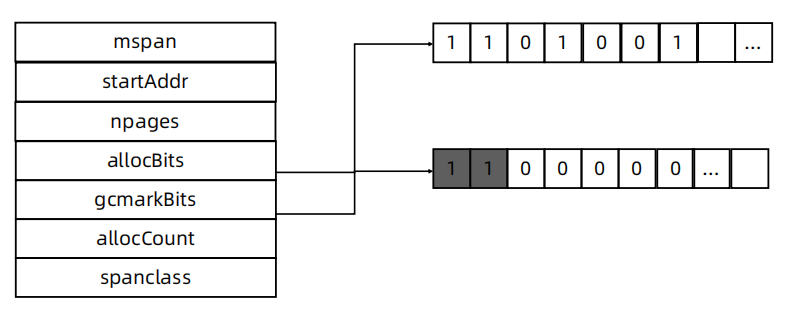

# 内存管理
## 关于内存管理的争论

## 堆内存管理

- 初始化连续内存块作为堆
- 有内存申请的时候，Allocator 从堆内存的未分配区域分割小内存块
- 用链表将已分配内存连接起来
- 需要信息描述每个内存块的元数据：大小，是否使用，下一个内存块的地址等

### 堆内存管理的挑战
- 内存分配需要系统调用，在频繁内存分配的时候，系统性能较低。
- 多线程共享相同的内存空间，同时申请内存时，需要加锁，否则会产生同一块内存被多个线程访问的情况。
- 内存碎片的问题，经过不断的内存分配和回收，内存碎片会比较严重，内存的使用效率降低。

## TCMalloc 概览

### TCMalloc
- page:内存页，一块 8K 大小的内存空间。Go 与操作系统之间的内存申请和释放，都是以page 为单位的
- span: 内存块，一个或多个连续的 page 组成一个 span 
- sizeclass : 空间规格，每个 span 都带有一个 sizeclass ，标记着该 span 中的 page 应该如何使用
- object : 对象，用来存储一个变量数据内存空间，一个 span 在初始化时，会被切割成一堆等大的 object ；假设 object 的大小是 16B ，span 大小是 8K ，那么就会把 span 中的 page 就会被初始化 8K / 16B = 512 个 object ，所谓内存分配，就是分配一个 object 出去 TCMalloc
- 对象大小定义
    - 小对象大小：0~256KB
    - 中对象大小：256KB~1MB
    - 大对象大小：>1MB
- 小对象的分配流程
    - ThreadCache -> CentralCache -> HeapPage，大部分时候，ThreadCache 缓存都是足够的，不需要去访问CentralCache 和 HeapPage，无系统调用配合无锁分配，分配效率是非常高的
- 中对象分配流程
    - 直接在 PageHeap 中选择适当的大小即可，128 Page 的 Span 所保存的最大内存就是 1MB
- 大对象分配流程
    - 从 large span set 选择合适数量的页面组成 span，用来存储数据
## Go 语言内存分配

- mcache：小对象的内存分配直接走
    - size class 从 1 到 66，每个 class 两个 span
    - Span 大小是 8KB，按 span class 大小切分
- mcentral
    - Span 内的所有内存块都被占用时，没有剩余空间继续分配对象，mcache 会向 mcentral 申请1个span，mcache 拿到 span 后继续分配对象
    - 当 mcentral 向 mcache 提供 span 时，如果没有符合条件的 span，mcentral 会向 mheap 申请span
- mheap
    - 当 mheap 没有足够的内存时，mheap 会向 OS 申请内存
    - Mheap 把 Span 组织成了树结构，而不是链表
    - 然后把 Span 分配到 heapArena 进行管理，它包含地址映射和 span 是否包含指针等位图
        - 为了更高效的分配、回收和再利用内存

## 内存回收
- 引用计数（Python，PHP，Swift） 
    - 对每一个对象维护一个引用计数，当引用该对象的对象被销毁的时候，引用计数减 1，当引用计数为 0 的时候，回收该对象
    - 优点：对象可以很快的被回收，不会出现内存耗尽或达到某个阀值时才回收
    - 缺点：不能很好的处理循环引用，而且实时维护引用计数，有也一定的代价
- 标记-清除（Golang） 
    - 从根变量开始遍历所有引用的对象，引用的对象标记为"被引用"，没有被标记的进行回收
    - 优点：解决引用计数的缺点
    - 缺点：需要 STW（stop the word），即要暂停程序运行
- 分代收集（Java） 
    - 按照生命周期进行划分不同的代空间，生命周期长的放入老年代，短的放入新生代，新生代的回收频率高于老年代的频率

## mspan
- allocBits
    - 记录了每块内存分配的情况
- gcmarkBits
    - 记录了每块内存的引用情况，标记阶段对每块内存进行标记，有对象引用的内存标记为1，没有的标记为 0
- 这两个位图的数据结构是完全一致的，标记结束则进行内存回收，回收的时候，将 allocBits 指 向 gcmarkBits，标记过的则存在，未进行标记的则进行回收

## GC 工作流程
Golang GC 的大部分处理是和用户代码并行的

- Mark：
    - Mark Prepare: 初始化 GC 任务，包括开启写屏障 (write barrier) 和辅助 GC(mutator assist)，统计root对象的任务数量等。这个过程需要STW
    - GC Drains: 扫描所有 root 对象，包括全局指针和 goroutine(G) 栈上的指针（扫描对应 G 栈时需停止该 G)，将其加入标记队列(灰色队列)，并循环处理灰色队列的对象，直到灰色队列为空。该过程后台并行执行
- Mark Termination：完成标记工作，重新扫描(re-scan)全局指针和栈。因为 Mark 和用户程序是并行的，所以在 Mark 过程中可能会有新的对象分配和指针赋值，这个时候就需要通过写屏障（write barrier）记录下来，re-scan 再检查一下，这个过程也是会 STW 的 - Sweep：按照标记结果回收所有的白色对象，该过程后台并行执行
- Sweep Termination：对未清扫的 span 进行清扫, 只有上一轮的 GC 的清扫工作完成才可以开始新一轮的 GC

## 三色标记
- GC 开始时，认为所有 object 都是 白色，即垃圾
- 从 root 区开始遍历，被触达的 object 置成 灰色
- 遍历所有灰色 object，将他们内部的引用变量置成 灰色，自身置成 黑色
- 循环第 3 步，直到没有灰色 object 了，只剩下了黑白两种，白色的都是垃圾
- 对于黑色 object，如果在标记期间发生了写操作，写屏障会在真正赋值前将新对象标记为 灰色
- 标记过程中，mallocgc 新分配的 object，会先被标记成 黑色 再返回

## 垃圾回收触发机制
- 内存分配量达到阀值触发 GC
    - 每次内存分配时都会检查当前内存分配量是否已达到阀值，如果达到阀值则立即启动 GC。 
        - 阀值 = 上次 GC 内存分配量 * 内存增长率
        - 内存增长率由环境变量 GOGC 控制，默认为 100，即每当内存扩大一倍时启动 GC。 
- 定期触发 GC
    - 默认情况下，最长 2 分钟触发一次 GC，这个间隔在 src/runtime/proc.go:forcegcperiod 变量中被声明
- 手动触发
    - 程序代码中也可以使用 runtime.GC()来手动触发 GC。这主要用于 GC 性能测试和统计。