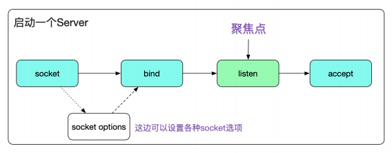
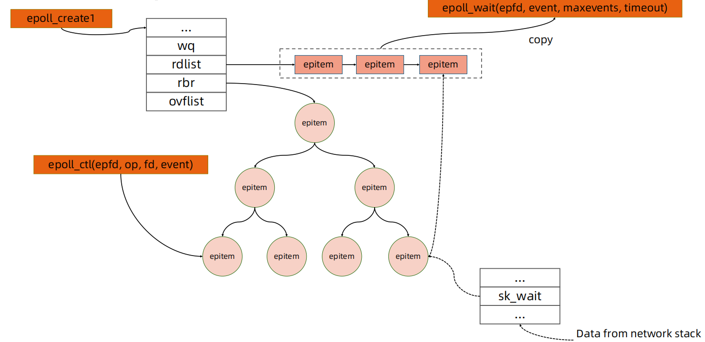

# 动手编写一个 HTTP Server
## 理解网络协议层

## 理解 Socket
- socket 被翻译为“套接字”，它是计算机之间进行通信的一种约定或一种方式
- Linux 中的一切都是文件
- 为了表示和区分已经打开的文件，UNIX/Linux 会给每个文件分配一个 ID，这个 ID 就是一个整数，被称为文件描述符
- 网络连接也是一个文件，它也有文件描述符
- 服务器端先初始化 Socket，然后与端口绑定（bind），对端口进行监听（listen），调用accept 阻塞，等待客户端连接
- 在这时如果有个客户端初始化一个 Socket，然后连接服务器（connect），如果连接成功，这时客户端与服务器端的连接就建立了
- 服务端的 Accept 接收到请求以后，会生成连接 FD，借助这个 FD 我们就可以使用普通的文件操作函数来传输数据了，例如：
    - 用 read() 读取从远程计算机传来的数据
    - 用 write() 向远程计算机写入数据

## 理解 net.http 包 
- 注册 handle 处理函数
```
http.HandleFunc("/healthz", healthz)
//Use the default DefaultServeMux. 
```
- ListenAndService
```
err := http.ListenAndServe(":80", nil)
if err != nil {
    log.Fatal(err)
}
```
- 定义 handle 处理函数
```
func healthz(w http.ResponseWriter, r *http.Request) {
    io.WriteString(w, "ok") 
}
```
## 阻塞 IO 模型

## 非阻塞 IO 模型

## IO 多路复用

## 异步 IO

## Linux epoll

## Go 语言高性能 httpserver 的实现细节
- Go 语言将协程与 fd 资源绑定
    - 一个 socket fd 与一个协程绑定
    - 当 socket fd 未就绪时，将对应协程设置为 Gwaiting 状态，将 CPU 时间片让给其他协程
    - Go 语言 runtime 调度器进行调度唤醒协程时，检查 fd 是否就绪，如果就绪则将协程置为Grunnable 并加入执行队列
    - 协程被调度后处理 fd 数据

## 代码实现细节
[代码实现细节](https://pouncing-waterfall-7c4.notion.site/http-server-socket-detail-e1f350d63c7c4d9f86ce140949bd90c2)
