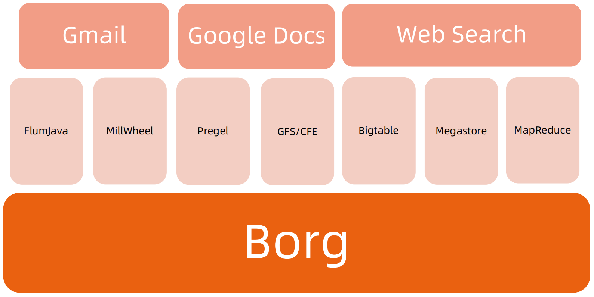
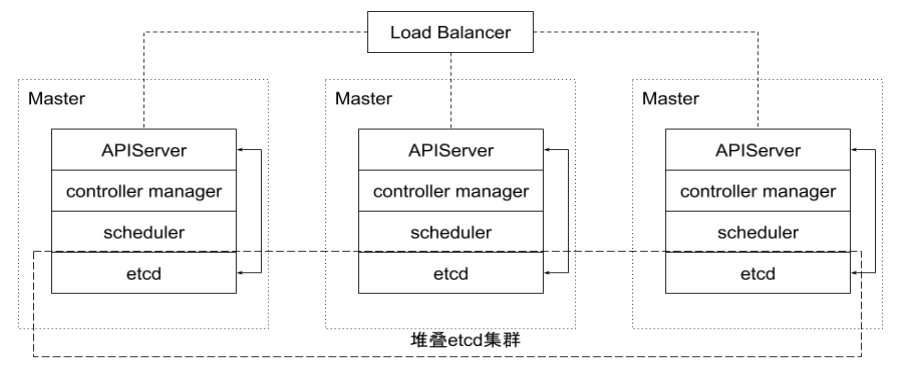
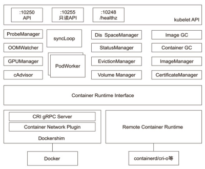

# Kubernetes 架构基础
## Borg

### Google Borg 简介
#### 特性
- 物理资源利用率高。 
- 服务器共享，在进程级别做隔离。 
- 应用高可用，故障恢复时间短。 
- 调度策略灵活。 
- 应用接入和使用方便，提供了完备的 Job 描述语言，服务发现，实时状态监控和诊断工具。
#### 优势
- 对外隐藏底层资源管理和调度、故障处理等。 
- 实现应用的高可靠和高可用。 
- 足够弹性，支持应用跑在成千上万的机器上。

### 基本概念
#### Workload
- prod：在线任务，长期运行、对延时敏感、面向终端用户等，比如Gmail, Google Docs, Web Search 服务等。 
- non-prod ：离线任务，也称为批处理任务（Batch），比如一些分布式计算服务等。
#### Cell
- 一个 Cell 上跑一个集群管理系统 Borg。 
- 通过定义 Cell 可以让Borg 对服务器资源进行统一抽象，作为用户就无需知道自己的应用跑在哪台机器上，也不用关心资源分配、程序安装、依赖管理、健康检查及故障恢复等。
#### Job 和 Task
- 用户以 Job 的形式提交应用部署请求。一个Job 包含一个或多个相同的 Task，每个 Task运行相同的应用程序，Task 数量就是应用的副本数。 
- 每个 Job 可以定义属性、元信息和优先级，优先级涉及到抢占式调度过程。
#### Naming
- Borg 的服务发现通过BNS （ Borg NameService）来实现。 
- 50.jfoo.ubar.cc.borg.google.com 可表示在一个名为 cc 的 Cell中由用户 uBar 部署的一个名为 jFoo 的 Job下的第50个 Task。

### Borg 架构


<font color=blue>Borgmaster 主进程：</font>

- 处理客户端 RPC 请求，比如创建 Job，查询 Job 等。 
- 维护系统组件和服务的状态，比如服务器、Task 等。 
- 负责与 Borglet 通信。

<font color=blue>Scheduler 进程：</font>

- 调度策略
    - Worst Fit
        - 调度到最空闲的机器，最终使得每台机器的资源消耗相近。
    - Best Fit
        - 调度到刚刚好满足资源的机器，方便得出最小需求机器的资源，将多余机器踢出节约成本。
    - Hybrid
- 调度优化
    - Score caching: 当服务器或者任务的状态未发生变更或者变更很少时，直接采用缓存数据，避免重复计算。 
    - Equivalence classes: 调度同一 Job 下多个相同的 Task 只需计算一次。 
    - Relaxed randomization: 引入一些随机性，即每次随机选择一些机器，只要符合需求的服务器数量达到一定值时，就可以停止计算，无需每次对 Cell 中所有服务器进行 feasibility checking。

<font color=blue>Borglet：</font>

- Borglet 是部署在所有服务器上的 Agent，负责接收 Borgmaster 进程的指令。

### 应用高可用
- 被抢占的 non-prod 任务放回 pending queue，等待重新调度。 
- <font color=blue>多副本应用跨故障域部署。</font>所谓故障域有大有小，比如相同机器、相同机架或相同电源插座等，一挂全挂。 
- 对于类似服务器或操作系统升级的维护操作，避免大量服务器同时进行。 
- 支持<font color=blue>幂等性</font>，支持客户端重复操作。 
- <font color=blue>当服务器状态变为不可用时，要控制重新调度任务的速率。</font>因为 Borg 无法区分是节点故障还是出现了短暂的网络分区，如果是后者，静静地等待网络恢复更利于保障服务可用性。 
- 当某种“任务 @ 服务器”的组合出现故障时，下次重新调度时需避免这种组合再次出现，因为极大可能会再次出现相同故障。 
- <font color=blue>记录详细的内部信息，便于故障排查和分析。 </font>
- <font color=blue>保障应用高可用的关键性设计原则：</font>无论何种原因，即使 Borgmaster 或者 Borglet 挂掉、失联，都不能杀掉正在运行的服务（Task）。

### Borg 系统自身高可用
- Borgmaster 组件多副本设计。 
- 采用一些简单的和底层（low-level）的工具来部署 Borg 系统实例，避免引入过多的外部依赖。 
- 每个 Cell 的 Borg 均独立部署，避免不同 Borg 系统相互影响。

### 资源利用率
- 通过将在线任务（prod）和离线任务（non-prod，Batch）混合部署，空闲时，离线任务可以充分利用计算资源；繁忙时，在线任务通过抢占的方式保证优先得到执行，合理地利用资源。 
- 98% 的服务器实现了混部。 
- 90% 的服务器中跑了超过 25 个 Task 和 4500 个线程。 
- 在一个中等规模的 Cell 里，在线任务和离线任务独立部署比混合部署所需的服务器数量多出约 20%-30%。可以简单算一笔账，Google 的服务器数量在千万级别，按 20% 算也是百万级别，大概能省下的服务器采购费用就是百亿级别了，这还不包括省下的机房等基础设施和电费等费用。

### Brog 调度原理


### 隔离性
<font color=blue>安全性隔离：</font>

- 早期采用 Chroot jail，后期版本基于 Namespace。

<font color=blue>性能隔离：</font>

- 采用基于 Cgroup 的容器技术实现。 
- 在线任务（prod）是延时敏感（latency-sensitive）型的，优先级高，而离线任务（non-prod，Batch）优先级低。 
- Borg 通过不同优先级之间的抢占式调度来优先保障在线任务的性能，牺牲离线任务。 
- Borg 将资源类型分成两类：
    - 可压榨的（compressible），CPU 是可压榨资源，资源耗尽不会终止进程；
    - 不可压榨的（non-compressible），内存是不可压榨资源，资源耗尽进程会被终止。

## 什么是 Kubernetes（K8s）


Kubernetes 是谷歌开源的容器集群管理系统，是 Google 多年大规模容器管理技术 Borg 的开源版本，主要功能包括：

- 基于容器的应用部署、维护和滚动升级；
- 负载均衡和服务发现；
- 跨机器和跨地区的集群调度；
- 自动伸缩；
- 无状态服务和有状态服务；
- 插件机制保证扩展性。

### 命令式（ Imperative）vs 声明式（ Declarative）
<font color=blue>命令式系统关注 “如何做”</font>

在软件工程领域，命令式系统是写出解决某个问题、完成某个任务或者达到某个目标的明确步骤。此方法明确写出系统应该执行某指令，并且期待系统返回期望结果。


<font color=blue>声明式系统关注“做什么”</font>

在软件工程领域，声明式系统指程序代码描述系统应该做什么而不是怎么做。仅限于描述要达到什么目的，如何达到目的交给系统。


### 声明式（Declaritive）系统规范
- 命令式：
    - 我要你做什么，怎么做，请严格按照我说的做。
- 声明式：
    - 我需要你帮我做点事，但是我只告诉你我需要你做什么，不是你应该怎么做。
    - 直接声明：我直接告诉你我需要什么。
    - 间接声明：我不直接告诉你我的需求，我会把我的需求放在特定的地方，请在方便的时候拿出来处理。
- 幂等性：
    - 状态固定，每次我要你做事，请给我返回相同结果。
- 面向对象的：
    - 把一切抽象成对象。

### Kubernetes：声明式系统
Kubernetes 的所有管理能力构建在对象抽象的基础上，核心对象包括：

- <font color=blue>Node</font>：计算节点的抽象，用来描述计算节点的资源抽象、健康状态等。 
- <font color=blue>Namespace</font>：资源隔离的基本单位，可以简单理解为文件系统中的目录结构。 
- <font color=blue>Pod</font>：用来描述应用实例，包括镜像地址、资源需求等。 Kubernetes 中最核心的对象，也是打通应用和基础架构的秘密武器。 
- <font color=blue>Service</font>：服务如何将应用发布成服务，本质上是负载均衡和域名服务的声明。

### Kubernetes 采用与 Borg 类似的架构


### 主要组件


### Kubernetes 的主节点（Master Node）
#### API服务器: API Server
这是 Kubernetes 控制面板中唯一带有用户可访问 API 以及用户可交互的组件。API 服务器会暴露一个 RESTful 的 Kubernetes API 并使用 JSON 格式的清单文件（manifest files）。
#### 群的数据存储: Cluster Data Store
Kubernetes 使 用“etcd”。这是一个强大的、稳定的、高可用的键值存储，被Kubernetes 用于长久储存所有的 API 对象。
#### 控制管理器: Controller Manager
被称为“kube-controller manager”，它运行着所有处理集群日常任务的控制器。包括了节点控制器、副本控制器、端点（endpoint）控制器以及服务账户等。
#### 调度器: Scheduler
调度器会监控新建的 pods（一组或一个容器）并将其分配给节点。
### Kubernetes 的工作节点（Worker Node）
#### Kubelet
负责调度到对应节点的 Pod 的生命周期管理，执行任务并将 Pod 状态报告给主节点的渠道，通过容器运行时（拉取镜像、启动和停止容器等）来运行这些容器。它还会定期执行被请求的容器的健康探测程序。
#### Kube-proxy
它负责节点的网络，在主机上维护网络规则并执行连接转发。它还负责对正在服务的 pods 进行负载平衡。

### etcd


etcd 是 CoreOS 基于 Raft 开发的分布式 key-value 存储，可用于服务发现、共享配置以及一致性保障（如数据库选主、分布式锁等）。

- 基本的 key-value 存储；
- 监听机制；
- key 的过期及续约机制，用于监控和服务发现；
- 原子 CAS 和 CAD，用于分布式锁和 leader 选举。

#### 直接访问 etcd 的数据
- 通过 etcd 进程查看启动参数
- 进入容器
    - ps -ef|grep etcd
    - sh: ps: command not found
- 怎么办？到主机 Namespace 查看 cert 信息
- 进入容器查询数据
```
export ETCDCTL_API=3
etcdctl --endpoints https://localhost:2379 --cert /etc/kubernetes/pki/etcd/server.crt --key /etc/kubernetes/pki/etcd/server.key --cacert /etc/kubernetes/pki/etcd/ca.crt get --keys-only --prefix /
```
- 监听对象变化
```
etcdctl --endpoints https://localhost:2379 --cert /etc/kubernetes/pki/etcd/server.crt --key /etc/kubernetes/pki/etcd/server.key --cacert /etc/kubernetes/pki/etcd/ca.crt watch --prefix /registry/services/specs/default/mynginx
```

### APIServer


Kube-APIServer 是 Kubernetes 最重要的核心组件之一，主要提供以下功能：

- 提供集群管理的 REST API 接口，包括: 
    - 认证 Authentication； 
    - 授权 Authorization； 
    - 准入 Admission（Mutating & Valiating）。 
- 提供其他模块之间的数据交互和通信的枢纽（其他模块通过 APIServer 查询或修改数据，只有 APIServer 才直接操作 etcd）。 
- APIServer 提供 etcd 数据缓存以减少集群对 etcd 的访问。

#### APIServer 展开


### Controller Manager
- Controller Manager 是集群的大脑，是确保整个集群动起来的关键；
- 作用是确保 Kubernetes 遵循声明式系统规范，确保系统的真实状态（ActualState）与用户定义的期望状态（Desired State）一致；
- Controller Manager 是多个控制器的组合，每个 Controller 事实上都是一个 control loop，负责侦听其管控的对象，当对象发生变更时完成配置；
- Controller 配置失败通常会触发自动重试，整个集群会在控制器不断重试的机制下确保最终一致性（ <font color=blue>Eventual Consistency</font>）。

#### 控制器的工作流程


#### Informer 的内部机制


#### 控制器的协同工作原理


### Scheduler


特殊的 Controller，工作原理与其他控制器无差别。

Scheduler 的特殊职责在于监控当前集群所有未调度的 Pod，并且获取当前集群所有节点的健康状况和资源使用情况，为待调度 Pod 选择最佳计算节点，完成调度。

<font color=blue>调度阶段分为：</font>
- Predict：过滤不能满足业务需求的节点，如资源不足、端口冲突等。 
- Priority：按既定要素将满足调度需求的节点评分，选择最佳节点。 
- Bind：将计算节点与 Pod 绑定，完成调度。

### Kubelet


Kubernetes 的初始化系统（init system） 

- 从不同源获取 Pod 清单，并按需求启停 Pod 的核心组件：
    - Pod 清单可从本地文件目录，给定的 HTTPServer 或 Kube-APIServer 等源头获取；
    - Kubelet 将运行时，网络和存储抽象成了 CRI，CNI，CSI。 
- 负责汇报当前节点的资源信息和健康状态； 
- 负责 Pod 的健康检查和状态汇报。

### Kube-Proxy


- 监控集群中用户发布的服务，并完成负载均衡配置。 
- 每个节点的 Kube-Proxy 都会配置相同的负载均衡策略，使得整个集群的服务发现建立在分布式负载均衡器之上，服务调用无需经过额外的网络跳转（Network Hop）。 
- 负载均衡配置基于不同插件实现：
    - userspace。 
    - 操作系统网络协议栈不同的 Hooks 点和插件：
        - iptables； 
        - ipvs。

### 推荐的 Add-ons
- kube-dns：负责为整个集群提供 DNS 服务； 
- Ingress Controller：为服务提供外网入口； 
- MetricsServer：提供资源监控； 
- Dashboard：提供 GUI； 
- Fluentd-Elasticsearch：提供集群日志采集、存储与查询。
