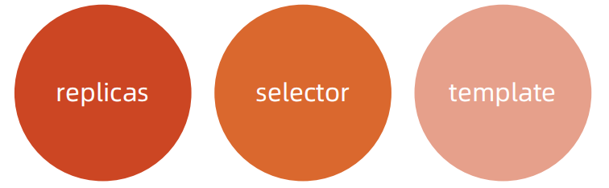

# 核心对象概览
## Node
- Node 是 Pod 真正运行的主机，可以物理机，也可以是虚拟机。 
- 为了管理 Pod，每个 Node 节点上至少要运行 container runtime（比如 Docker 或者 Rkt）、Kubelet 和 Kube-proxy 服务。

## Namespace
<font color=blue>Namespace 是对一组资源和对象的抽象集合</font>，比如可以用来将系统内部的对象划分为不同的项目组或用户组。

常见的 pods, services, replication controllers 和 deployments 等都是属于某一个 Namespace 的（默认是 default），而 Node, persistentVolumes 等则不属于任何 Namespace。

## 什么是 Pod


- Pod 是一组紧密关联的容器集合，它们共享 PID、IPC、Network 和 UTS namespace，是 Kubernetes 调度的基本单位。
- Pod 的设计理念是支持多个容器在一个 Pod 中共享网络和文件系统，可以通过进程间通信和文件共享这种简单高效的方式组合完成服务。
- 同一个 Pod 中的不同容器可共享资源： 
    - 共享网络 Namespace； 
    - 可通过挂载存储卷共享存储； 
    - 共享 Security Context。

```
apiVersion: v1
kind: Pod
metadata:
  name: hello
spec:
  containers:
  - image: nginx:1.15
    name: nginx
```

## 如何通过 Pod 对象定义支撑应用运行


## 存储卷
- 通过存储卷可以将外挂存储挂载到 Pod 内部使用。 
- 存储卷定义包括两个部分: Volume 和 VolumeMounts。 
    - Volume：定义 Pod 可以使用的存储卷来源； 
    - VolumeMounts：定义存储卷如何 Mount 到容器内部。

```
apiVersion: v1
kind: Pod
metadata:
  name: hello-volume
spec:
  containers:
  - image: nginx:1.15
    name: nginx
    volumeMounts: 
    - name: data
      mountPath: /data
  volumes:
  - name: data
    emptyDir: {}
```

## Pod 网络
Pod的多个容器是共享网络 Namespace 的，这意味着：

- 同一个 Pod 中的不同容器可以彼此通过 Loopback 地址访问： 
    - 在第一个容器中起了一个服务 http://127.0.0.1 。 
    - 在第二个容器内，是可以通过 httpGet http://172.0.0.1 访问到该地址的。
- 这种方法常用于不同容器的互相协作。

## 资源限制
Kubernetes 通过 Cgroups 提供容器资源管理的功能，可以限制每个容器的CPU 和内存使用，比如对于刚才创建的 deployment，可以通过下面的命令限制nginx 容器最多只用 50% 的 CPU 和 128MB 的内存：
```
$ kubectl set resources deployment nginx-app -c=nginx --limits=cpu=500m,memory=128Mi 
deployment "nginx" resource requirements updated
```
### 等同于在每个 Pod 中设置 resources limits
```
apiVersion: v1
kind: Pod
metadata:
  labels:
    app: nginx
  name: nginx
spec:
  containers: 
    - image: nginx
      name: nginx
      resources:
        limits:
          cpu: "500m"
          memory: "128Mi"
```

## 健康检查
Kubernetes 作为一个面向应用的集群管理工具，需要确保容器在部署后确实处在正常的运行状态。

1. <font color=blue>探针类型：</font>

    - LivenessProbe
        - 探测应用是否处于健康状态，如果不健康则删除并重新创建容器。
    - ReadinessProbe
        - 探测应用是否就绪并且处于正常服务状态，如果不正常则不会接收来自 Kubernetes Service 的流量。
    - StartupProbe
        - 探测应用是否启动完成，如果在 failureThreshold*periodSeconds 周期内未就绪，则会应用进程会被重启。

2. <font color=blue>探活方式：</font>

    - Exec
    - TCP socket
    - HTTP

## 健康检查 spec
```
apiVersion: extensions/v1beta1
kind: Deployment
metadata:
  labels:
   app: nginx
  name: nginx-default
spec:
  replicas: 3
  selector:
    matchLabels:
      app: nginx
  template:
    metadata:
      labels:
        app: nginx
spec:
  containers: 
  - image: nginx
    imagePullPolicy: Always
    name: http
    resources: {}
    terminationMessagePath:/dev/termination-log
    terminationMessagePolicy: File
    resources:
      limits:
        cpu: "500m"
        memory: "128Mi"
    livenessProbe:
      httpGet:
        path: /
        port: 80
      initialDelaySeconds: 15
      timeoutSeconds: 1
    readinessProbe:
      httpGet:
        path: /ping
        port: 80
      initialDelaySeconds: 5
      timeoutSeconds: 1
```

## ConfigMap
- ConfigMap 用来将非机密性的数据保存到键值对中。
- 使用时， Pods 可以将其用作环境变量、命令行参数或者存储卷中的配置文件。
- ConfigMap 将环境配置信息和 容器镜像解耦，便于应用配置的修改。

## 密钥对象（Secret） 
- Secret 是用来保存和传递密码、密钥、认证凭证这些敏感信息的对象。
- 使用 Secret 的好处是可以避免把敏感信息明文写在配置文件里。
- Kubernetes 集群中配置和使用服务不可避免的要用到各种敏感信息实现登录、认证等功能，例如访问 AWS 存储的用户名密码。
- 为了避免将类似的敏感信息明文写在所有需要使用的配置文件中，可以将这些信息存入一个 Secret 对象，而在配置文件中通过 Secret 对象引用这些敏感信息。
- 这种方式的好处包括：意图明确，避免重复，减少暴漏机会。

## 用户（User Account）& 服务帐户（Service Account） 
- 顾名思义，用户帐户为人提供账户标识，而服务账户为计算机进程和 Kubernetes 集群中运行的 Pod 提供账户标识。
- <font color=blue>用户帐户和服务帐户的一个区别是作用范围</font>：
    - 用户帐户对应的是人的身份，人的身份与服务的 Namespace 无关，所以用户账户是跨Namespace 的；
    - 而服务帐户对应的是一个运行中程序的身份，与特定 Namespace 是相关的。

## Service


Service 是应用服务的抽象，通过 labels 为应用提供负载均衡和服务发现。匹 配 labels 的 Pod IP 和端口列表组成 endpoints，由 Kube-proxy 负责将服务 IP 负载均衡到这些 endpoints 上。

每个 Service 都会自动分配一个 cluster IP（仅在集群内部可访问的虚拟地址） 和 DNS 名，其他容器可以通过该地址或 DNS 来访问服务，而不需要了解后端容器的运行。

### Service Spec
```
apiVersion: v1
kind: Service
metadata:
  name: nginx
spec:
  ports:
  - port: 8078 # the port that this service should serve on
    name: http
    # the container on each pod to connect to, can be a name
    # (e.g. 'www') or a number (e.g. 80)
    targetPort: 80
    protocol: TCP
  selector:
    app: nginx
```

## 副本集（Replica Set） 

[图片来源](https://draveness.me/kubernetes-replicaset/)

- Pod 只是单个应用实例的抽象，要构建高可用应用，通常需要构建多个同样的副本，提供同一个服务。
- Kubernetes 为此抽象出副本集 ReplicaSet，其允许用户定义 Pod 的副本数，每一个 Pod 都会被当作一个无状态的成员进行管理，Kubernetes 保证总是有用户期望的数量的 Pod 正常运行。
- 当某个副本宕机以后，控制器将会创建一个新的副本。
- 当因业务负载发生变更而需要调整扩缩容时，可以方便地调整副本数量。

## 部署（Deployment） 

[图片来源](https://draveness.me/kubernetes-deployment/)

- 部署表示用户对 Kubernetes 集群的一次更新操作。
- 部署是一个比 RS 应用模式更广的 API 对象，可以是创建一个新的服务，更新一个新的服务，也可以是滚动升级一个服务。
- 滚动升级一个服务，实际是创建一个新的 RS，然后逐渐将新 RS 中副本数增加到理想状态，将旧 RS 中的副本数减小到 0 的复合操作。
- 这样一个复合操作用一个 RS 是不太好描述的，所以用一个更通用的 Deployment 来描述。
- 以 Kubernetes 的发展方向，未来对所有长期伺服型的的业务的管理，都会通过 Deployment 来管理。

### Try it
通过类似 Docker run 的命令在 Kubernetes 运行容器
```
kubectl run --image=nginx:alpine nginx-app --port=80
kubectl get deployment
kubectl describe deployment/rs/pod
kubectl expose deployment nginx-app --port=80 --target-port=80
kubectl describe svc
kubectl describe ep
```

## 有状态服务集（StatefulSet） 

[图片来源](https://draveness.me/kubernetes-statefulset/)

- 对于 StatefulSet 中的 Pod，每个 Pod 挂载自己独立的存储，如果一个 Pod 出现故障，从其他节点启动一个同样名字的Pod，要挂载上原来 Pod 的存储继续以它的状态提供服务。
- 适合于 StatefulSet 的业务包括数据库服务 MySQL 和 PostgreSQL，集群化管理服务 ZooKeeper、etcd 等有状态服务。
- 使用 StatefulSet，Pod 仍然可以通过漂移到不同节点提供高可用，而存储也可以通过外挂的存储来提供高可靠性，StatefulSet 做的只是将确定的 Pod 与确定的存储关联起来保证状态的连续性。

## Statefulset 与 Deployment 的差异
- <font color=blue>身份标识</font>
    - StatefulSet Controller 为每个 Pod 编号，序号从0开始。
- <font color=blue>数据存储</font>
    - StatefulSet 允许用户定义 volumeClaimTemplates，Pod 被创建的同时，Kubernetes 会以volumeClaimTemplates 中定义的模板创建存储卷，并挂载给 Pod。 
- <font color=blue>StatefulSet 的升级策略不同</font>
    - onDelete
    - 滚动升级
    - 分片升级

## 任务（Job） 

[图片来源](https://draveness.me/kubernetes-job-cronjob/)

- Job 是 Kubernetes 用来控制批处理型任务的 API 对象。
- Job 管理的 Pod 根据用户的设置把任务成功完成后就自动退出。
- 成功完成的标志根据不同的 spec.completions 策略而不同：
    - 单 Pod 型任务有一个 Pod 成功就标志完成；
    - 定数成功型任务保证有 N 个任务全部成功；
    - 工作队列型任务根据应用确认的全局成功而标志成功。

## 后台支撑服务集（DaemonSet）
- 长期伺服型和批处理型服务的核心在业务应用，可能有些节点运行多个同类业务的 Pod，有些节点上又没有这类 Pod 运行；
- 而后台支撑型服务的核心关注点在 Kubernetes 集群中的节点（物理机或虚拟机），要保证每个节点上都有一个此类 Pod 运行。 
- 节点可能是所有集群节点也可能是通过 nodeSelector 选定的一些特定节点。 
- 典型的后台支撑型服务包括存储、日志和监控等在每个节点上支撑 Kubernetes 集群运行的服务。


[图片来源](https://draveness.me/kubernetes-daemonset/)

## 存储 PV 和 PVC
- PersistentVolume（PV）是集群中的一块存储卷，可以由管理员手动设置，或当用户创建 PersistentVolumeClaim（PVC）时根据 StorageClass 动态设置。
- PV 和 PVC 与 Pod 生命周期无关。也就是说，当 Pod 中的容器重新启动、Pod 重新调度或者删除时，PV 和 PVC 不会受到影响，Pod 存储于 PV 里的数据得以保留。
- 对于不同的使用场景，用户通常需要不同属性（例如性能、访问模式等）的 PV。

## CustomResourceDefinition
- CRD 就像数据库的开放式表结构，允许用户自定义 Schema。 
- 有了这种开放式设计，用户可以基于 CRD 定义一切需要的模型，满足不同业务的需求。
- 社区鼓励基于 CRD 的业务抽象，众多主流的扩展应用都是基于 CRD 构建的，比如 Istio、Knative。 
- 甚至基于 CRD 推出了 Operator Mode 和 Operator SDK，可以以极低的开发成本定义新对象，并构建新对象的控制器。

## 课后练习 4.2
- 启动一个 Envoy Deployment。 
- 要求 Envoy 的启动配置从外部的配置文件 Mount 进 Pod。 
- 进入 Pod 查看 Envoy 进程和配置。 
- 更改配置的监听端口并测试访问入口的变化。 
- 通过非级联删除的方法逐个删除对象。
