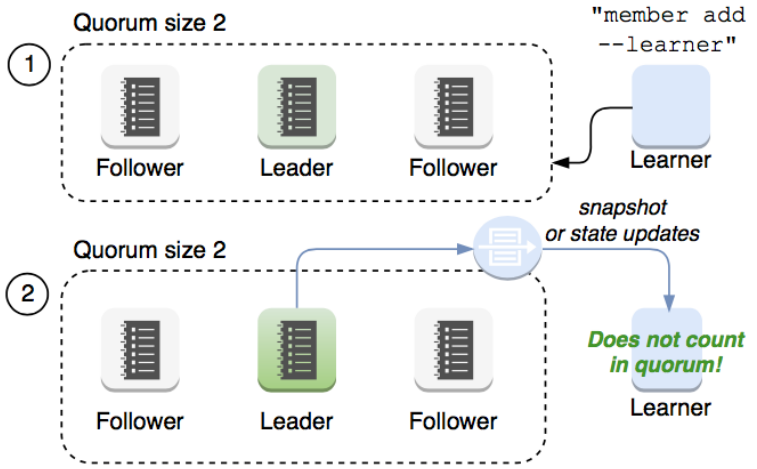

# Raft协议
## Raft协议概览
Raft 协议基于 quorum 机制, 即大多数同意原则, 任何的变更都需超过半数的成员确认


## 理解Raft协议(非常好)
[http://thesecretlivesofdata.com/raft/](http://thesecretlivesofdata.com/raft/)

### learner
Raft 4.2.1 引入的新角色

当出现一个 etcd 集群需要增加节点时, 新节点与 Leader 的数据差异较大, 需要较多数据同步才能跟上 leader 的最新的数据. 

此时 Leader 的网络带宽很可能被用尽, 进而使得 leader 无法正常保持心跳. 

进而导致 follower 重新发起投票. 

进而可能引发 etcd 集群不可用. 

<font color="blue">Learner 角色只接收数据而不参与投票, 因此增加 learner 节点时, 集群的 quorum 不变. </font>


### etcd基于Raft的一致性
选举方法

- 初始启动时, 节点处于 follower 状态并被设定一个 election timeout, 如果在这一时间周期内没有收到来自 leader 的 heartbeat, 节点将发起选举: 将自己切换为 candidate 之后, 向集群中其它 follower 节点发送请求, 询问其是否选举自己成为 leader. 
- 当收到来自集群中过半数节点的接受投票后, 节点即成为 leader, 开始接收保存 client 的数据并向其它的 follower 节点同步日志. 如果没有达成一致, 则 candidate 随机选择一个等待间隔(150ms ~ 300ms) 再次发起投票, 得到集群中半数以上 follower 接受的 candidate 将成为 leader
- leader 节点依靠定时向 follower 发送 heartbeat 来保持其地位. 
- 任何时候如果其它 follower 在 election timeout 期间都没有收到来自 leader 的 heartbeat, 同样会将自己的状态切换为 candidate 并发起选举. 每成功选举一次, 新 leader 的任期(Term)都会比之前 leader 的任期大1. 

## 日志复制
当接 Leader 收到客户端的日志(事务请求)后先把该日志追加到本地的 Log 中, 然后通过 heartbeat 该Entry同步给其他 Follower, Follower 接收到日志后记录日志然后向 Leader 发送 ACK, 当 Leader 收到大多数(n/2+1) Follower 的 ACK 信息后将该日志设置为已提交并追加到本地磁盘中, 通知客户端并在下个 heartbeat 中 Leader 将通知所有的 Follower 将该日志存储在自己的本地磁盘中. 

## 安全性
安全性是用于保证每个节点都执行相同序列的安全机制, 如当某个 Follower 在当前 Leader commit Log 时变得不可用了, 稍后可能该 Follower 又会被选举为 Leader, 这时新 Leader 可能会用新的 Log 覆盖先前已 committed 的 Log, 这就是导致节点执行不同序列；Safety 就是用于保证选举出来的 Leader 一定包含先前 committed Log 的机制；

选举安全性(Election Safety): 每个任期(Term)只能选举出一个 Leader

Leader 完整性(Leader Completeness): 指 Leader 日志的完整性, 当 Log 在任期 Term1 被 Commit 后, 那么以后任期 Term2、Term3... 等的 Leader 必须包含该 Log; Raft 在选举阶段號使用 Term 的判断用于保证完整性: 当请求投票的该 Candidate 的 Term 较大或 Term 相同 Index 更大则投票, 否则拒绝该请求. 

## 失效处理
1. Leader 失效: 其他没有收到 heartbeat 的节点会发起新的选举, 而当 Leader 复后由于步进数小会自动成为 follower (日志也会被新 leader 的日志覆盖)
2. follower 节点不可用: follower 节点不可用的情况相对容易解决. 因为集群中的日志内容始终是从 leader 节点同步的, 只要这一节点再次加入集群时重新从 leader 节点处复制日志即可. 
3. 多个 candidate: 冲突后 candidate 将随机选择一个等待间隔(150ms - 300ms)再次发起投票, 得到集群中半数以上 follower 接受的 candidate 将成为 leader

## wal日志(write ahead log)
- wal 日志是二进制的, 解析出来后是以上数据结构 LogEntry. 
- 其中第一个字段 type, —种是 0 表示 Normal, 1 表示 ConfChange ConfChange 表示 Etcd 本身的配置变更同步, 比如有新的节点加入等). 第二个字段是 term, 每个 term 代表一个主节点的任期, 每次主节点变更 term 就会变化. 第三个字段是 index, 这个序号是严格有序递增的, 代表变更序号. 第四个字段是二进制的 data, 将 raft request 对象的 pb 结构整个保存下. 
- etcd 源码下有个 tools/etcd-dump-logs, 可以将 wal 日志 dump 成文本查看, 可以协助分析 Raft 协议. 
- Raft 协议本身不关心应用数据, 也就是 data 中的部分, 一致性都通过同步 wal 日志来实现, 每个节点将从主节点收到的 data apply 到本地的存储, Raft 只关心日志的同步状态, 如果本地存储实现的有 bug, 比如没有正确南将 data apply 到本地, 也可能会导致数据不一致. 


## etcd v3存储, Watch以及过期机制


### 存储机制
etcd v3 store 分为两部分, 一部分是内存中的索引, kvindex, 是基于 Google 开源的一个 Golang 的 btree 实现的, 另外一部分是后端存储. 按照它的设计, backend 可以对接多种存储, 当前使用的 boltdb. boltdb 是一个单机的支持事务的 kv 存储, etcd 的事务是基于 boltdb 的事务实现的. etcd 在 boltdb 中存储的 key 是 reversion, value 是 etcd 自己的 key-value 组合, 也就是说 etcd 会在 boltdb 中把每个版本都保存下, 从而实现了多版本机制. 

reversion 主要由两部分组成, 第一部分 main rev, 每次事务进行加一, 第二部分 sub rev, 同一个事务中的每次操作加一. 

etcd 提供了命令和设置选项来控制 compact, 同时支持 put 操作的参数来精确控制某个 key 的历史版本数. 

内存 kvindex 保存的就是 key 和 reversion 之前的映射关系, 用来加速查询. 


## Etcd 的数据一致性


## Watch机制
etcd v3 的 watch 机制支持 watch 某个固定的 key, 也支持 watch 一个范围(可以用于模拟目录的 结构的 watch), 所以 watchGroup 包含两种 watcher, —种是 key watchers, 数据结构是每个 key 对应一组 watcher, 另外一种是 range watchers, 数据结构是一个 IntervalTree, 方便通过区间查找到对应的 watcher. 

同时, 每个 WatchableStore 包含两种 watcherGroup, —种是 synced, —种是 unsynced, 前者表示该 group 的 watcher 数据都已经同步完毕, 在等待新的变更, 后者表示该 group 的 watcher 数据同步落后于当前最新变更, 还在追赶. 

当 etcd 收到客户端的 watch 请求, 如果请求携带了 revision 参数, 则比较请求的 revision 和 store 当前的 revision, 如果大于当前 revision, 则放入 synced 组中, 否则放入 unsynced组. 同时 etcd 会启动一个后台的 goroutine 持续同步 unsynced 的 watcher, 然后将其迁移到 synced 组. 也就是这种机制下, etcd v3 支持从任意版本开 Swatch, 没有 v2 的 1000 条历史 event 表限制的问题(当然这是指没有 compact 的情况下)

## etcd练习
查看集群成员状态 `etcdctl member list --write-out=table`
```

```

启动新etcd集群
```
docker run -d registry.aliyuncs.com/google_containers/etcd:3.5.0-0 /usr/local/bin/etcd
```

进入etcd容器
```
docker ps|grep etcd
docker exec -it <containerid> sh
```

存入数据
```
etcdctl put x 0
```

读取数据
```
etcdctl get x -w=json
```
```

```

修改值
```
etcdctl put x 1
```

查询最新值
```
etcdctl get x
```

查询历史版本值
```
etcdctl get x --rev=2
```

## etcd成员重要参数
成员相关参数
```
--name 'default1
  Human-readable name for this member.
--data-dir '${name}.etcd'
  Path to the data directory.
--listen-peer-urls 'http://localhost:2380'
  List of URLs to listen on for peer traffic.
--listen-client-urls 'http://localhost:2379'
  List of URLs to listen on for client traffic.
```

## etcd集群重要参数
集群相关参数
```
--initial-advertise-peer-urls 'http://localhost:2380'
  List of this member's peer URLs to advertise to the rest of the cluster.
--initial-cluster 'default=http://localhost:2380'
  Initial cluster configuration for bootstrapping.
--initial-cluster-state 'new'
  Initial cluster state('new' or 'existing1).
--initial-cluster-token 'etcd-cluster'
  Initial cluster token for the etcd cluster during bootstrap.
--advertise-client-urls 'http://localhost:2379'
  List of this member's client URLs to advertise to the public.
```
### etcd安全相关参数
```
--cert-file "
  Path to the client server TLS cert file.
--key-file "
  Path to the client server TLS key file, 
--client-crl-file "
  Path to the client certificate revocation List file, 
--trusted-ca-file "
  Path to the client server TLS trusted CA cert file, 
--peer-cert-file "
  Path to the peer server TLS cert file.
--peer-key-file "
  Path to the peer server TLS key file, 
--peer-trusted-ca-file "
  Path to the peer server TLS trusted CA file.
```

## 灾备
- 创建 Snapshot
```
    etcdctl —endpoints https://127.0.0.1:3379 —cert /tmp/etcd-certs/certs/127.0.0.1 .pem - -key /tmp/etcd-certs/certs/127.0.0.1 -key.pem --cacert /tmp/etcd-certs/certs/ca.pem snapshot save snapshot.db
```
- 恢复数据
```
    etcdctl snapshot restore snapshot.db \
    --name infra2 \
    --data-dir=/tmp/etcd/infra2 \
    --initial-cluster
    infra0=http://127.0.0.1:3380Jnfra1=http://127.0.0.1:4380Jnfra2=http://127.0.0.1:5380
    --initial-cluster-token etcd-cluster-1 \
    --initial-advertise-peer-urls http://127.0.0.1:5380
```

## 容量管理
- 单个对象不建议超过1.5M 
- 默认容量2G
- 不建议超过8G

## Alarm & Disarm Alarm
- 设置 etcd 存储大小
```
$ etcd --quota-backend-bytes=$((16*1024*1024))
```
- 写爆磁盘
```
$ while [1]; do dd if=/dev/urandom bs=1024 count=1024 | ETCDCTL_API=3 etcdctl put key || break; done
```
- 查看endpoint状态
```
$ ETCDCTL_API=3 etcdctl --write-out=table endpoint status
```
- 查看alarm
```
$ ETCDCTL_API=3 etcdctl alarm list
```
- 清理碎片
```
$ ETCDCTL_API=3 etcdctl defrag
```
- 清理alarm
```
$ ETCDCTL_API=3 etcdctl alarm disarm
```

## 碎片整理
```
#keep one hour of history
$ etcd --auto-compaction-retention=1

#compact up to revision 3
$ etcdctl compact 3

$ etcdctl defrag
Finished defragmenting etcd member[127.0.0.1:2379]
```

## 课后练习5.1
- 按照课上讲解的方法在本地构建一个单节点的基于HTTPS的etcd集群
- 写一条数据
- 查看数据细节
- 删除数据
