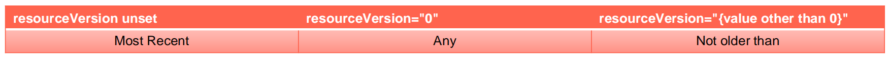

# etcd 常见问题
多少个 peer 最适合?

- 1个？ 3个？ 5个？
- 保证高可用是首要目标
- 所有写操作都要经过 leader
- peer 多了是否能提升集群并读操作的并发能力？
    - apiserver 的配置只连本地的 etcd peer
    - apiserver 的配置指定所有 etcd peers, 但只有当前连接的 etcd member 异常, apiserver 才会换目标
- 需要动态 flex up吗？

## 保证 apiserver 和 etcd 之间的高效性通讯
保证 apiserver 和 etcd 之间的高效性通讯

- apiserver 和 etcd部署在同-节点
- apiserver 和 etcd之间的通讯基于 gRPC
    - 针对每一个 object, apiserver 和 etcd 之间的 Connection -> stream 共享
    - HTTP/2 的特性
        - Stream quota
        - 带来的问题？对于大规模集群，会造成链路阻塞
        - 10000 个 pod，—次 list 操作需要返回的数据可能超过 100M
            - k get pod --all-namespaces|wc -l
            - 8520 
            - k get pod -oyaml --all-namespaces>pods
            - Is -I pods
            - -rw-r--r-- 1 root root 75339736 Apr 5 03:13 pods

## 数据备份
- 备份方案
    - 基于事件重放
    - etcd备份：备份完整的集群信息，灾难恢复
        - etcdctl snapshot save
- 频度？
    - 时间间隔太长：
        - 能否接受user data lost?
        - 如果有外部资源配置，如负载均衡等，能否接受数据丢失导致的leak? 
    - 时间间隔太短：
        - 对etcd的影响
            - 做snapshot的时候，etcd会锁住当前数据
            - 并发的写操作需要开辟新的空间进行增量写，导致磁盘空间增长 如何保证备份的时效性，同时防止磁盘爆掉？
- 如何保证备份的时效性，同时防止磁盘爆掉？
    - Auto defrag?

## 增强版backup方案


## etcd
安全性

- peer和peer之间的通讯加密
    - 是否有需求
        - TLS的额外开销
        - 运营复杂度增加

## etcd数据加密
- https://kubernetesjo/docs/tasks/administer-cluster/encrypt-data/

```
apiVersion: API Server.config.k8s.io/v1 
kind: Encryptionconfiguration
resources:
    - resources:
        - secrets 
        providers:
        - identity: {}
        - aesgcm: 
            keys:
            - name:	key1
              secret: c2VjcmV0IGlzIHNlY3VyZQ==
            - name:	key2
              secret: dGhpcyBpcyBwYXNzd29yZA==
        - aescbc:
            keys:
            - name: key1 
              secret: c2VjcmV0IGlzIHNlY3VyZQ==
        - secretbox:
            keys:
            - name:	key1
              secret: YWJjZGVmZ2hpamtsbW5vcHFyc3R1dnd4eXoxMjM0NTY= 
        - kms:
            name: myKmsPlugin 
            endpoint: unix:///tmp/socketfile.sock 
            cachesize: 100
```

## Kubernetes中数据分离
- 对于大规模集群/大量的事件会对etcd造成压力
- API server启动脚本中指定etcd servers集群
```
/usr/local/bin/kube-apiserver --etcd-servers=https://localhost:4001 --etcd- cafile=/etc/ssl/kubernetes/ca.crt--storage-backend=etcd3 --etcd-servers- overrides=/events#https://localhost:4002
```

## 查询 APIServer
返回某namespace中的所有Pod
```
GET /api/vl /namespaces/test/pods
200 OK
Content-Type: application/json
(
    "kind": "PodList",
    "apiVersion": "vl",
    "metadata": ("resourceversion":"!0245"},
    "items": [...]
}
```

## 从12345版本开始，监听所有对象变化
```
GET /api/vl /namespaces/test/pods?watch=1 &resourceVersion=10245
200 OK
Transfer-Encoding: chunked
Content-Type: application/json
{
"type": "ADDED",
"object": {"kind": "Pod", "apiVersion": "vl", "metadata": ("resourceversion": "10596",...}
)
(
"type": "MODIFIED",
"object": {"kind": "Pod", "apiVersion": "vl", "metadata": {"resourceVersion": "11020",...),...)
}
```

## 分页查询
```
GET /api/v1/pods?limit=500
---
200 OK
Content-Type: application/json
{
    "kind": "PodList,
    "apiVersion": "vl",
    "metadata": {
        "resourceVersion":"10245",
        "continue": "HENCODED_CONTINUE_TOKEN",
        },
    "items": [...] // returns pods 1-500
}
```

```
GET /api/v1/pods?limit=500&contnue=ENCODED_CONTINUE_TOKEN
---
200 OK
Content-Type: application/json
{
    "kind": "PodList",
    "apiVersion": "v1",
    "metadata": {
        "resourceVersionn":"10245",
        "continue": "ENCODED_CONTINUE_TOKEN_2,
        },
    "items": [...] // returns pods 501-1000
}
```

## Resourceversion
- 单个对象的 resourceversion
    - 对象的最后修改 resourceversion
- List 对象的 resourceversion
    - 生成 list response 时的 resourceversion
- List 行为
    - List 对象时,如果不加 resourceversion，意味着需要 Most Recent 数据，请求会击穿 APIServer 缓存，直接发送至 etcd
    - APIServer 通过 Label 过滤对象查询时，过滤动作是在 APIServer 端，APIServer 需要向 etcd 发起全量查询请求



## 遭遇到的陷阱
频繁的 leader election<br>
etcd 分裂<br>
etcd 不响应<br>
与 apiserver 之间的链路阻塞<br>
磁盘暴涨<br>

## 少数 etcd 成员 Down


## Master 节点出现网络分区
Case:网络分区出现<br>
Group#1：master-1，master-2<br>
Group#2：master-3，master-4，master-5<br>


## 课后练习 5.2
在 Kubernetes 集群中创建一个高可用的 etcd 集群
## 参考资料
B树和B+树: [https://segmentfault.com/a/1190000020416577](https://segmentfault.com/a/1190000020416577) <br>
Etcd流程分析: [https://www.jianshu.com/p/2614fdb5d1c3](https://www.jianshu.com/p/2614fdb5d1c3)
