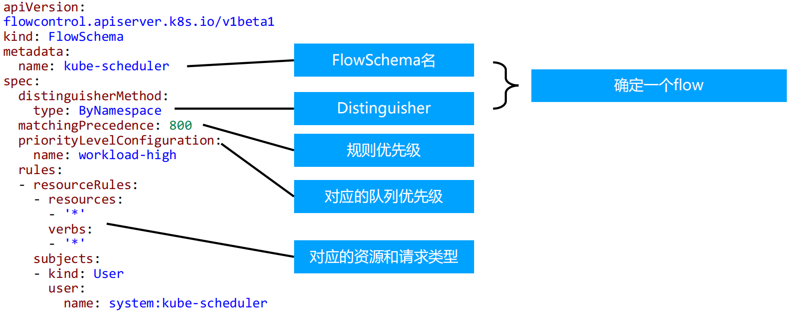

## 计数器固定窗口算法
原理就是对一段固定时间窗口内的请求进行计数, 如果请求数超过了阈值, 则舍弃该请求;  
如果没有达到设定的阈值, 则接受该请求, 且计数加1.  
当时间窗口结束时, 重置计数器为0. 

## 计数器滑动窗口算法
在固定窗口的基础上, 将一个计时窗口分成了若干个小窗口, 然后每个小窗口维护一个独立的计数器.  
当请求的时间大于当前窗口的最大时间时, 则将计时窗口向前平移一个小窗口.  
平移时, 将第一个小窗口的数据丢弃, 然后将第二个小窗口设置为第一个小窗口, 同时在最后面新增一个小窗口, 将新的请求放在新增的小窗口中.  
同时要保证整个窗口中所有小窗口的请求数目之后不能超过设定的阈值. 

## 漏斗算法
漏斗算法的原理也很容易理解. 请求来了之后会首先进到漏斗里, 然后漏斗以恒定的速率将请求流出进行处理, 从而起到平滑流量的作用.  
当请求的流量过大时, 漏斗达到最大容量时会溢出, 此时请求被丢弃.  
在系统看来, 请求永远是以平滑的传输速率过来, 从而起到了保护系统的作用.  

## 令牌桶算法

令牌桶算法是对漏斗算法的一种改进, 除了能够起到限流的作用外, 还允许一定程度的流量突发.  
在令牌桶算法中, 存在一个令牌桶, 算法中存在一种机制以恒定的速率向令牌桶中放入令牌.  
令牌桶也有一定的容量, 如果满了令牌就无法放进去了.  
当请求来时, 会首先到令牌桶中去拿令牌, 如果拿到了令牌, 则该请求会被处理, 并消耗掉拿到的令牌;  
如果令牌桶为空, 则该请求会被丢弃. 

## APIServer 中的限流

- max-requests-inflight: 在给定时间内的最大 non-mutating 请求数
- max-mutating-requests-inflight: 在给定时间内的最大 mutating 请求数, 调整 apiserver 的流控 qos

代码: staging/src/k8s.io/apiserver/pkg/server/filters/maxinflight.go:WithMaxInFlightLimit()

## 传统限流方法的局限性
- 粒度粗
    - 无法为不同用户, 不同场景设置不通的限流
- 单队列
    - 共享限流窗口/桶, 一个坏用户可能会将整个系统堵塞, 其他正常用户的请求无法被及时处理
- 不公平
    - 正常用户的请求会被排到队尾, 无法及时处理而饿死
- 无优先级
    - 重要的系统指令一并被限流, 系统故障难以恢复
 
## API Priority and Fairness

- APF 以更细粒度的方式对请求进行分类和隔离. 
- 它还引入了空间有限的排队机制, 因此在非常短暂的突发情况下, API 服务器不会拒绝任何请求. 
- 通过使用公平排队技术从队列中分发请求, 这样, 一个行为不佳的控制器就不会饿死其他控制器(即使优先级相同). 
- APF的核心
    - 多等级
    - 多队列
- APF 的实现依赖两个非常重要的资源 FlowSchema, PriorityLevelConfiguration
- APF 对请求进行更细粒度的分类, 每一个请求分类对应一个 FlowSchema (FS)
- FS 内的请求又会根据 distinguisher 进一步划分为不同的 Flow.
- FS 会设置一个优先级 (Priority Level, PL), 不同优先级的并发资源是隔离的. 所以不同优先级的资源不会相互排挤. 特定优先级的请求可以被高优处理. 
- 一个 PL 可以对应多个 FS, PL 中维护了一个 QueueSet, 用于缓存不能及时处理的请求, 请求不会因为超出 PL 的并发限制而被丢弃. 
- FS 中的每个 Flow 通过 shuffle sharding 算法从 QueueSet 选取特定的 queues 缓存请求. 
- 每次从 QueueSet 中取请求执行时, 会先应用 fair queuing 算法从 QueueSet 中选中一个 queue, 然后从这个 queue 中取出 oldest 请求执行. 所以即使是同一个 PL 内的请求, 也不会出现一个 Flow 内的请求一直占用资源的不公平现象. 

### 概念

- 传入的请求通过 FlowSchema 按照其属性分类, 并分配优先级. 
- 每个优先级维护自定义的并发限制, 加强了隔离度, 这样不同优先级的请求, 就不会相互饿死. 
- 在同一个优先级内, 公平排队算法可以防止来自不同 flow 的请求相互饿死. 
- 该算法将请求排队, 通过排队机制, 防止在平均负载较低时, 通信量突增而导致请求失败. 

### 优先级

- 如果未启用 APF, API 服务器中的整体并发量将受到 kube-apiserver 的参数 --max-requests-inflight 和 --max-mutating-requests-inflight 的限制. 
- 启用 APF 后, 将对这些参数定义的并发限制进行求和, 然后将总和分配到一组可配置的优先级中. 每个传入的请求都会分配一个优先级; 
- 每个优先级都有各自的配置, 设定允许分发的并发请求数. 
- 例如, 默认配置包括针对领导者选举请求、内置控制器请求和 Pod 请求都单独设置优先级. 这表示即使异常的 Pod 向 API 服务器发送大量请求, 也无法阻止领导者选举或内置控制器的操作执行成功. 

### 排队

- 即使在同一优先级内, 也可能存在大量不同的流量源. 
- 在过载情况下, 防止一个请求流饿死其他流是非常有价值的 (尤其是在一个较为常见的场景中, 一个有故障的客户端会疯狂地向 kube-apiserver 发送请求, 理想情况下, 这个有故障的客户端不应对其他客户端产生太大的影响). 
- 公平排队算法在处理具有相同优先级的请求时, 实现了上述场景. 
- 每个请求都被分配到某个流中, 该流由对应的 FlowSchema 的名字加上一个流区分项(Flow Distinguisher) 来标识. 
- 这里的流区分项可以是发出请求的用户、目标资源的名称空间或什么都不是. 
- 系统尝试为不同流中具有相同优先级的请求赋予近似相等的权重. 
- 将请求划分到流中之后, APF 功能将请求分配到队列中. 
- 分配时使用一种称为混洗分片(Shuffle-Sharding)的技术. 该技术可以相对有效地利用队列隔离低强度流与高强度流. 
- 排队算法的细节可针对每个优先等级进行调整, 并允许管理员在内存占用、公平性(当总流量超标时, 各个独立的流将都会取得进展)、突发流量的容忍度以及排队引发的额外延迟之间进行权衡. 

### 豁免请求

某些特别重要的请求不受制于此特性施加的任何限制. 这些豁免可防止不当的流控配置完全禁用 API 服务器. 

### 默认配置

- system
    - 用于 system:nodes 组(即 kubelets) 的请求; kubelets 必须能连上 API 服务器, 以便工作负载能够调度到其上. 
- leader-election
    - 用于内置控制器的领导选举的请求 (特别是来自 kube-system 名称空间中 system:kube-controller-manager 和 system:kube-scheduler 用户和服务账号, 针对 endpoints、configmaps 或 leases 的请求).
    - 将这些请求与其他流量相隔离非常重要, 因为领导者选举失败会导致控制器发生故障并重新启动, 这反过来会导致新启动的控制器在同步信息时, 流量开销更大. 
- workload-high
    - 优先级用于内置控制器的请求. 
- workload-low
    - 优先级适用于来自任何服务帐户的请求, 通常包括来自 Pods 中运行的控制器的所有请求. 
- global-default
    - 优先级可处理所有其他流量, 例如: 非特权用户运行的交互式 kubectl 命令. 
- exempt
    - 优先级的请求完全不受流控限制: 它们总是立刻被分发. 特殊的 exempt FlowSchema 把 system:masters 组的所有请求都归入该优先级组. 
- catch-all
    - 优先级与特殊的 catch-all FlowSchema 结合使用, 以确保每个请求都分类. 
    - 一般不应该依赖于 catch-all 的配置, 而应适当地创建自己的 catch-all FlowSchema 和 PriorityLevelConfigurations (或使用默认安装的 global-default 配置). 
    - 为了帮助捕获部分请求未分类的配置错误, 强制要求 catch-all 优先级仅允许5个并发份额, 并且不对请求进行排队, 使得仅与 catch-all FlowSchema 匹配的流量被拒绝的可能性更高, 并显示 HTTP 429 错误. 

### PriorityLevelConfiguration

一个 PriorityLevelConfiguration 表示单个隔离类型.  
每个 PriorityLevelConfigurations 对未完成的请求数有各自的限制, 对排队中的请求数也有限制. 

### FlowSchema
FlowSchema 匹配一些入站请求, 并将它们分配给优先级.  
每个入站请求都会对所有 FlowSchema 测试是否匹配, 首先从 matchingPrecedence 数值最低的匹配开始 (我们认为这是逻辑上匹配度最高), 然后依次进行, 直到首个匹配出现

### 调试

- /debug/api_priority_and_fairness/dump_priority_levels —— 所有优先级及其当前状态 的列表

kubectl get --raw /debug/api_priority_and_fairness/dump_priority_levels

- /debug/api_priority_and_fairness/dump_queues —— 所有队列及其当前状态的列表 

kubectl get --raw /debug/api_priority_and_fairness/dump_queues

- /debug/api_priority_and_fairness/dump_requests —— 当前正在队列中等待的所有请求 的列表

kubectl get --raw /debug/api_priority_and_fairness/dump_requests
